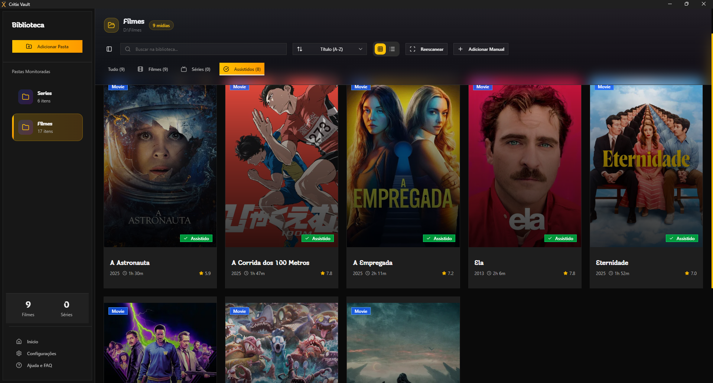
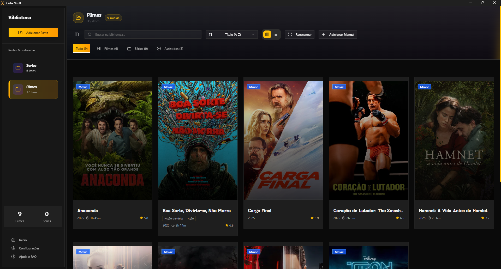
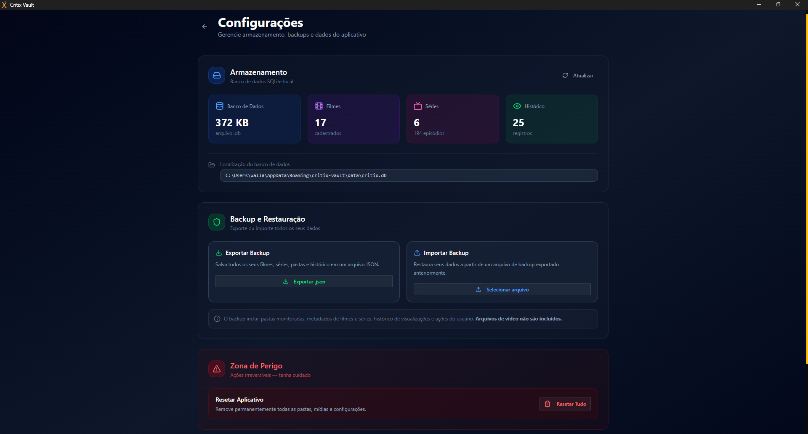
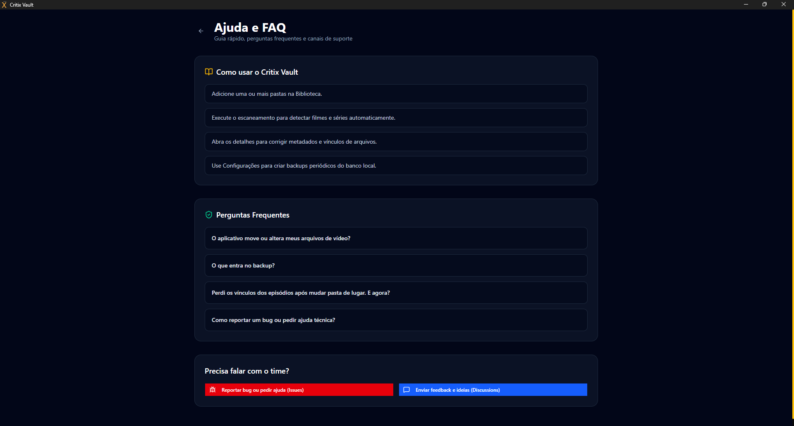
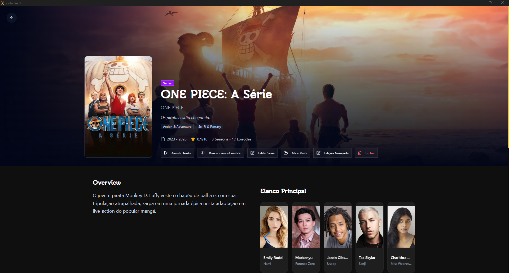
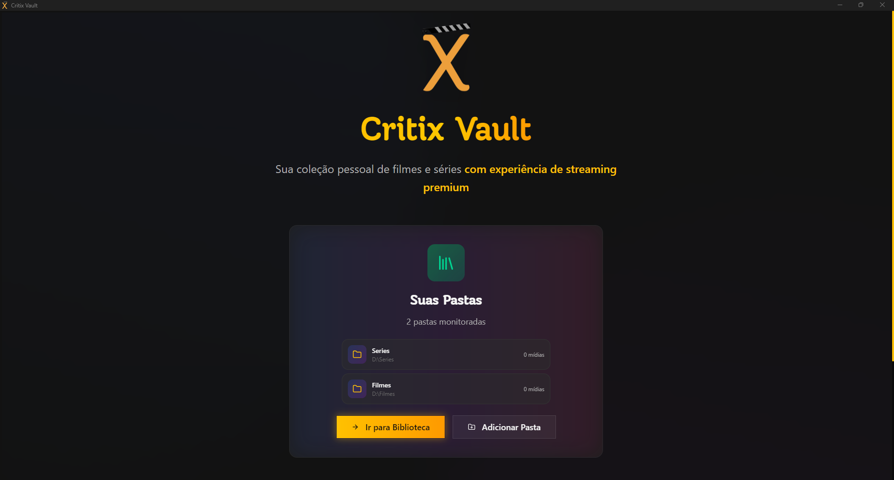
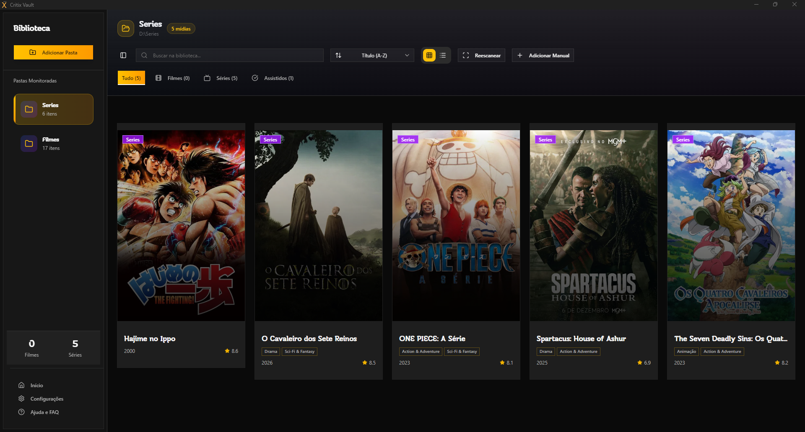

# Critix Vault

### Sua biblioteca de filmes e series com cara de streaming

---

## Visao Geral

O Critix Vault organiza as pastas que voce ja tem no computador e transforma isso em uma biblioteca bonita, rapida e facil de navegar.

Sem precisar renomear tudo manualmente, o app encontra filmes e series, cria as capas, separa temporadas e deixa tudo pronto para abrir e assistir.

---

## O Que Voce Pode Fazer

- Adicionar pastas da sua colecao com poucos cliques.
- Escanear e montar biblioteca automaticamente.
- Visualizar filmes e series em layout moderno.
- Abrir detalhes com informacoes completas da midia.
- Corrigir dados e caminhos quando precisar.
- Editar episodios individualmente ou em lote por temporada.
- Marcar episodios e temporadas como assistidos.
- Fazer backup e restaurar sua biblioteca.
- Usar modo demonstracao para testar o app.

---

## Experiencia

| Destaque               | Como isso ajuda no dia a dia                   |
| ---------------------- | ---------------------------------------------- |
| Biblioteca visual      | Facilita achar rapidamente o que assistir      |
| Organizacao por pasta  | Voce continua usando sua estrutura atual       |
| Edicao avancada        | Corrige episodios e caminhos sem dor de cabeca |
| Historico de assistido | Mantem o controle do que ja foi visto          |
| Fluxo simples          | Menos tempo organizando, mais tempo assistindo |

---

## Capturas de Tela

> Dica: para atualizar esta secao, substitua as imagens em public/images/readme mantendo os mesmos nomes.

| Biblioteca                                           | Catalogo                                                 |
| ---------------------------------------------------- | -------------------------------------------------------- |
|  |  |

| Config                                               | Help                                                     |
| ---------------------------------------------------- | -------------------------------------------------------- |
|  |  |

| Serie Screen                                         | Movie Screen                                                     |
| ---------------------------------------------------- | -------------------------------------------------------- |
|  |  |

| Destaques                                               | Interface                                                    |
| ------------------------------------------------------- | ------------------------------------------------------------ |
|  |  |

---

## Primeiros Passos

Se voce quer apenas usar e testar:

1. Abra o app.
2. Clique em Adicionar Pasta.
3. Aguarde o escaneamento inicial.
4. Pronto, sua biblioteca comeca a aparecer.

---

## Documentacao

- Guia tecnico principal: [docs/tech/TECHNICAL_OVERVIEW.md](docs/tech/TECHNICAL_OVERVIEW.md)
- Mapa de documentos: [docs/tech/FILE_INDEX.md](docs/tech/FILE_INDEX.md)
- Tarefas e planejamento: [docs/tasks.md](docs/tasks.md)

---

## Contribuicao

Contribuicoes sao bem-vindas.

1. Faça um fork do projeto.
2. Crie uma branch para sua melhoria.
3. Envie seu pull request com uma descricao objetiva.

---

## Creditos

- Criado por Wallace Santana.
- Integrado com [Critix API](https://github.com/wallacemt/critix-backend) e [TMDB](https://www.themoviedb.org/).

---

## Licenca

Projeto sob licenca MIT. Veja [LICENSE](LICENSE).
